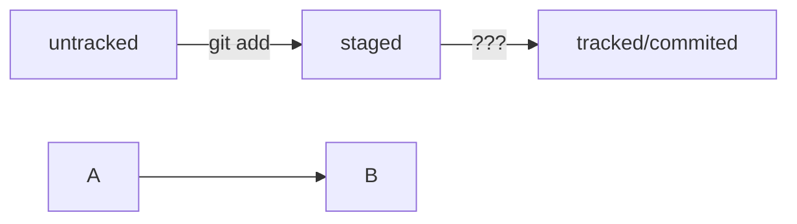

# HEADER 1
Text 1
---
*Text 2 italic*
**Text 3 bold**
~~Strikethrough~~

[Progresstech](https://progresstech.ru/ru/?q= "Прогресстех!")

```bash
ls -la
```

## HEADER 2

### HEADER 3

# COMMIT BLOCK SCHEME

